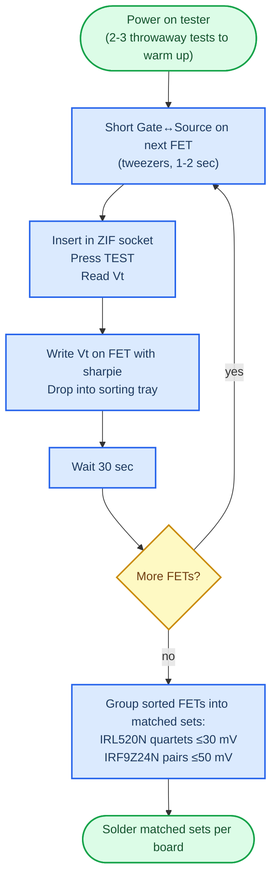

# Step 2 — Order parts

Two BOM files, one purpose: get the right parts in the right quantities.

| File | What it's for |
|---|---|
| [`BOM_Mouser.csv`](BOM_Mouser.csv) | Direct import into Mouser's BOM Tool. Strict 4-column format — don't edit. |
| [`BOM_full.csv`](BOM_full.csv) | Human-readable master with descriptions, designators, and Mouser + Amazon search links. |

## How to use

1. Sign in to [mouser.com](https://www.mouser.com/) and open the **BOM Tool**.
2. Upload `BOM_Mouser.csv`.
3. Review and add to cart.
4. For anything Mouser doesn't carry (or anything cheaper on Amazon — screws, standoffs, headers, LCD), use the Amazon links in `BOM_full.csv`.

## v1.4 part recommendations

[`../1-order-boards/v1.4-release-notes.txt`](../1-order-boards/v1.4-release-notes.txt) covers what changed from v1.3:

- C6, C7 should be **low-ESR** electrolytics
- With 42TU200 transformers and higher output, use 0.27 Ω at R30 and 680–820 µF at C6/C7
- R55 backlight: 100–220 Ω for New Haven LCDs
- J2-J7 can be substituted with [STX-3100-5N](https://www.mouser.com/ProductDetail/Kycon/STX-3100-5N) (no plastic back cover)

## ⚠️ Critical parts — the BOM deliberately over-orders five things

These are intentional over-quantities for matching and spares. **Don't reduce them** when you place the order.

| Part | Designators | Need per board | BOM qty | Why |
|---|---|---|---|---|
| **IRL520N** | Q1, Q2, Q4, Q5 | 4 | 12 | Sort by Vt and pick a quartet matched within ≤30 mV. Typical batch spread is 200–400 mV — you need 3× over-order to find a tight cluster of 4. |
| **IRF9Z24NPBF** | Q3, Q6 | 2 | 6 | Sort and pick a pair matched within ≤50 mV, with absolute Vt 2.85–3.05 V. Reject any > 3.30 V. |
| **R35, R46** (200 kΩ) | R35, R46 | 2 | 4 | Op-amp bias network — wrong value or a damaged trace is a top Failure 20 cause. Spares cost pennies. |
| **R30** (0.27 Ω 1 W) | R30 | 1 | 3 | Current-sense resistor — value-critical for F20 calibration. Easy to damage during desolder rework. |
| **XTAL1** (8 MHz) | XTAL1 | 1 | 2 | Cracked/cold-soldered crystal silently breaks ATmega ISP programming. Cheap insurance. |

The full reasoning — Vt-headroom math, the Vishay vs Infineon supplier trap, sort-and-pair logic for assigning specific FETs to specific board positions — lives in [`../3-build-and-flash/troubleshooting/debug-notes/failure-20-analysis.md`](../3-build-and-flash/troubleshooting/debug-notes/failure-20-analysis.md). Read it before populating boards if you want the full picture; the BOM quantities here are just enough to make that procedure possible.

## 🛠️ Step-by-step — matching the MOSFETs

Do this **before soldering**. Allow 30–45 minutes for 5 boards' worth of parts.

### What you need

- **Component tester** — LCR-P1 or LCR-T7 (the 2-decimal Mega328 variants). Plain 1-decimal Mega328 testers don't have the resolution to sort within 30 mV.
- **Fine-tip permanent marker** (sharpie) to label each FET with its measured Vt.
- **Sorting tray** — egg carton, ice-cube tray, or a piece of paper with rows labeled by Vt range.

### The flow



### Per-FET procedure

1. **Discharge the gate.** Touch the leftmost lead (Gate) to the rightmost lead (Source) on the TO-220 with tweezers for 1–2 seconds. Skipping this step is the #1 cause of run-to-run jitter.
2. **Insert in the tester.** Hold the FET by the metal tab only — body heat on the leads shifts Vt by ~6 mV/°C, enough to corrupt the reading.
3. **Press TEST.** Read the Vgs(th) value (e.g., `1.94 V`).
4. **Label and sort.** Write the Vt on the FET package with the sharpie. Drop it in your sorting tray under its Vt range.
5. **Wait ~30 seconds** before the next FET — thermal settling.

### Pick the matched sets

After all FETs are tested and sorted:

**IRL520N quartet — one per board (Q1, Q2, Q4, Q5):** pick four FETs within ≤30 mV of each other. Sort that quartet ascending, then pair the lowest two on channel A (Q1, Q2) and the next two on channel B (Q4, Q5).

Example with a clean quartet:

```
Sorted Vt:    1.91   1.92   1.92   1.93     (20 mV spread — excellent)
Channel A:    1.91   1.92                   → Q1, Q2
Channel B:           1.92   1.93            → Q4, Q5
```

**IRF9Z24N pair — one per board (Q3, Q6):** pick two FETs matched within ≤50 mV, **both in the 2.85–3.05 V cluster** if you can. The detailed Vt-acceptability tiers (Use first / Acceptable / Marginal / Reject) are in [`failure-20-analysis.md`](../3-build-and-flash/troubleshooting/debug-notes/failure-20-analysis.md).

### If your sample doesn't yield a tight quartet

Two options:

| Option | Tradeoff |
|---|---|
| Build with a wider quartet (50–80 mV) | Probably passes F20 but pulse symmetry is degraded. Output feels asymmetric and metal electrodes corrode faster (Lilly-wave electromigration). |
| Order more IRL520Ns from the same Mouser reel and merge into the pool | Tightens the available cluster. Adds ~$10 and a week of shipping per board you couldn't match. |

## Tester quirks worth knowing

The LCR-P1 has 2-decimal precision but ~30–100 mV of run-to-run noise from gate-charge memory, probe contact variation, and the tester's own ramp-and-detect algorithm. The per-FET procedure above is what controls those.

For a single FET you suspect of jittering more than expected:

1. Take **5 readings** of the same FET, with full discharge + 30 sec wait between each.
2. Drop the highest and lowest.
3. Average the middle 3 → that's your sorting value.

If a single FET still spreads > 50 mV after that procedure, the tester or ZIF socket has a problem (worn contacts, dead battery, EMI nearby). Borrow a different unit before trusting the data.

## Substitutions

Parts you couldn't find? The metafetish forum archive has practical substitutions from people who actually built the box: [`../3-build-and-flash/troubleshooting/MK-312BT parts substitution - Estim - Metafetish.pdf`](../3-build-and-flash/troubleshooting/MK-312BT%20parts%20substitution%20-%20Estim%20-%20Metafetish.pdf).

→ Next: [Step 3 — Build and flash](../3-build-and-flash/)
