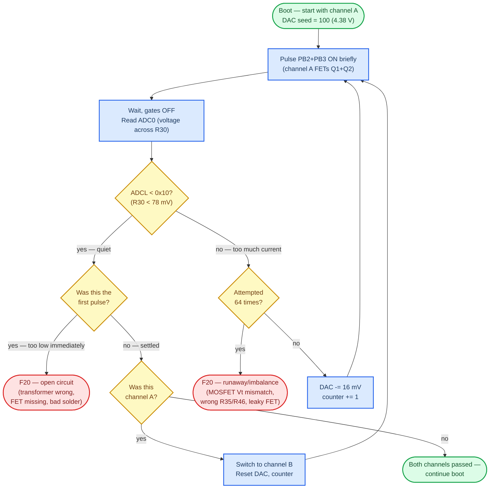

# Failure 20 — output stage current sense (channels A and B)

| Field | Value |
| --- | --- |
| Code (decimal) | **20** |
| Branch site | `0x1494` (`rjmp .+480` → `0x1676`) |
| Test type | Output stage current-sense, both channels |
| When it runs | Once at boot, after F21 voltage check passes |
| Class | Almost always hardware — MOSFETs, transformer, R35/R46 |

## Summary

F20 is the post-boot output-stage self-test, and the most common build failure
on first power-up. A single routine at `Function_0x1406` drives PB2+PB3
(channel A) and then PB0+PB1 (channel B) while monitoring ADC0 (R30 current
sense). On each pass it ramps the DAC down from a low-power seed and looks
for the R30 current to settle within bounds. If either channel can't deliver
current, or the current runs away, F20 fires.

**The forum lore that pairs F20 (channel A) with F21 (channel B) is wrong** —
F20 alone tests both channels; F21 is the wall-adapter voltage check.

### How the calibration loop works



A working unit settles around step 42 of 64 — that's ~22 steps of headroom (~484 mV at the Q3 gate). Vt drift in Q3 eats this headroom; see [MOSFET matching procedure](#mosfet-matching-procedure) below for the math.

## Disassembly evidence

```
1406:  ; init counters
140c:  ldi  r16, 0           ; channel-select flag: 0=A, 1=B
1410:  ldi  r26, 100         ; DAC seed = 100 (≈OUTA 4.38 V)
143a:  cp   r16, 0
143c:  brne 0x1444           ; channel B branch
143e:  ldi  r26, 0x0c        ; PORTB = 0b00001100 (PB2+PB3 = q5+q6)
1440:  out  PORTB, r26       ; ← drives channel A FETs
1444:  ldi  r26, 0x03        ; PORTB = 0b00000011 (PB0+PB1 = q7+q8)
1446:  out  PORTB, r26       ; ← drives channel B FETs
1448-1452:                   ; pulse-width delay
1456:  out  PORTB, 0         ; gates OFF
1458-145c:                   ; wait for ADC, read ADCL
1460:  cpi  r26, 0x10        ; ADCL < 16 ? (≈61 mV)
1462:  brcc 0x1476           ;   yes → settled, advance
1464:  inc  r27              ; pulse counter
1466:  cpi  r27, 0x40        ; 64 attempts ?
1468:  brcc 0x1492           ; ← 64 attempts exhausted → F20
146a-1474:                   ; decrement DAC, loop back
1476:  cmp  r27, 0
1478:  breq 0x1492           ; ← first pulse already too LOW = open → F20
...                          ; advance to channel B (r16=1) and repeat
1492:  ldi  r26, 0x14        ; ← loads code 20
1494:  rjmp 0x1676           ; ← FAILURE 20
```

Two distinct ways to trip F20:

- **(a)** First pulse already reads ADCL < 16 — meaning no current is flowing
  through R30 even at the high-power DAC seed. This points at an **open
  circuit** in the output stage (transformer wired wrong, FET missing,
  broken solder joint).
- **(b)** 64 successive pulses fail to bring ADCL below the threshold — the
  firmware can never get the channel quiet. This points at a **runaway /
  imbalanced** output (mismatched MOSFET Vt, leaky FET, wrong R35/R46 value).

## Likely cause

**Most common (in this order):**

1. **MOSFET Vt mismatch** — IRL520 quartet or IRF9Z24 pair with > ~50 mV
   spread in gate threshold voltage. The output stage can't keep R32 and R43
   balanced.
2. **Transformer reversed** — primary wired backward, current direction wrong.
3. **R35/R46 wrong value** — should be 200 kΩ. A 20 kΩ or 2 MΩ here throws
   off the gate bias.
4. **FET orientation** — IRL520 / IRF9Z24 placed backwards.
5. **DAC fault** — LTC1661 not communicating, or one of its outputs stuck.
   Last resort.

## Diagnostic procedure

1. **Measure DC voltage across R32 and across R43** with the box powered on,
   no patient cables connected. Both should read between **4.0 V and 4.4 V**
   and be very close to each other (within ~50 mV).
2. If R32 ≠ R43: **MOSFET mismatch**. Desolder the IRL520 quartet, measure
   Vt of each on a component tester, replace with a matched set (target
   spread < 20 mV).
3. If R32 = R43 but both out of range (e.g. both 1 V or both 5 V): check
   transformer orientation, R35 and R46 values, FET orientations.
4. **Before soldering on a fresh build**: pre-match every IRL520 / IRF9Z24
   with a component tester. A ~$15 Mega328-based tester from Amazon
   (B0DDBPWYP8) will save you hours of debugging.

## MOSFET matching procedure

### Calibration math (from the disassembly above)

The firmware ramps the DAC from `r26=100` (4.38 V) downward in ~16 mV steps,
up to 64 attempts, looking for ADCL < 16 (~78 mV across R30). Forum data
(Sirius #48, mer #45 in `Another Failure 20…`) shows a working unit settles
at **step 42 with the DAC at ~3.6 V** — leaving **~22 steps of calibration
headroom**. Translated to Q3 gate voltage (op-amp gain ~1.4×), one DAC step
is ~22 mV at the gate, so the ramp covers a ~1.4 V window of Q3 Vgs(th).

Vt outside that window — or so far from the working baseline that it eats
all the headroom — trips F20.

### Target Vt and matching tolerance

| Part | Position(s) | Target Vt | Per-group spread (ideal / acceptable) | Why |
| --- | --- | --- | --- | --- |
| **IRL520N** | Q1, Q2 (channel A) and Q5, Q6 (channel B) | 1.6–2.0 V (typ ~1.8 V) | ≤ 20 mV / ≤ 50 mV within each pair | Switches, not in calibration loop. Vt asymmetry = pulse asymmetry → electromigration on metal electrodes (Lilly's wave is broken). |
| **IRF9Z24N** (Infineon) | Q3, Q4 | 2.5–3.1 V (target ~2.98 V — bumerang's working baseline) | ≤ 50 mV / ≤ 100 mV within the Q3/Q4 pair | In the calibration servo. Each 22 mV of Vt offset eats one calibration step. Vt > 3.3 V leaves only ~8 steps headroom — marginal. |

### Why the IRL tolerance is tighter than the IRF tolerance

Counterintuitive at first — you'd expect the FET *inside* the calibration servo to need
tighter matching than the FETs outside it. The opposite is true here, and the reason
comes down to what each mismatch actually affects.

#### IRL520N — bounded by output-pulse symmetry

The MK-312 produces **biphasic pulses** by design: Q1 and Q2 alternate switching the
transformer primary in opposite directions, producing equal-and-opposite positive and
negative pulses on the secondary. Identical Vt across the pair → symmetric pulses.

If Vt(Q1) ≠ Vt(Q2), both FETs receive the same 5 V gate drive but conduct slightly
different currents (lower-Vt FET has more `Vgs − Vt` overdrive → lower Rds(on) →
conducts more current per pulse). The positive half of the bipolar pulse ends up with
a slightly different peak than the negative half. There's no firmware compensation —
Q1 and Q2 are pure switches.

**~20–30 mV is fine.** More mismatch isn't going to injure anyone — output currents
and average DC offsets at typical use stay well below medical-device DC thresholds
even at 100+ mV mismatch. What you'd actually notice with looser matching is
**asymmetric sensation** — one direction of the pulse feeling different from the
other, which most users find less pleasant or less effective.

Rough scale of what mismatch translates to:

| Vt mismatch | Current-per-pulse imbalance | Practical effect |
| --- | --- | --- |
| ≤ 20 mV | ~0.7% | Symmetric, indistinguishable from a perfectly-matched pair |
| 30–50 mV | ~1–1.7% | Still symmetric in feel for most users |
| 100 mV | ~3.5% | Edge of perceptibility — sensitive users may notice subtle channel asymmetry |
| 200 mV+ | ~7%+ | Asymmetric feel becomes obvious; long-term electrode wear accelerates |

So **≤ 20 mV ideal, ≤ 50 mV acceptable** is a comfort-and-symmetry target, not a
safety target. Below ~20 mV the asymmetry from Vt mismatch is in the noise floor of
the rest of the circuit (transformer winding tolerance, PCB trace differences,
Rds(on) production variance) — tighter doesn't measurably help.

#### IRF9Z24N — bounded by F20 calibration headroom

Q3 and Q6 are tested **independently** by the firmware (channel A's calibration ramp
runs on Q3, channel B's on Q6). They're never in a comparison loop with each other,
so Q3↔Q6 mismatch has no direct effect on F20 outcome.

What does matter: each one's **absolute Vt** must fit inside the firmware's 64-step
DAC ramp window. Lower absolute Vt = more steps of headroom for any other component
drift to push you toward F20 without crossing the threshold.

So the rule reverses:

- Absolute Vt cluster: **2.85–3.05 V** (within ±50 mV of bumerang's 2.98 V working
  reference) — this is the constraint that matters.
- Pair match-tightness: looser (≤ 50 mV ideal, ≤ 100 mV acceptable) because the
  firmware compensates each channel independently.

Matching Q3 to Q6 within ~50 mV gives symmetric feel between channels, but it's a
UX consideration, not an F20 one.

### IRF9Z24 manufacturer trap (high-yield F20 root cause)

Forum-confirmed (bumerang #10, #14 in `Another Failure 20…`, plus Gary #18,
LynxTail #49):

- **IRF9Z24NPBF (Infineon)** — Vt ~2.98 V, **WORKS**.
- **IRF9Z24PBF (Vishay)** — Vt ~3.58 V, **FAILS F20**.
- Counterfeit Chinese IRF9Z24N (smaller die, off characteristics) — also fails.

Always verify the **N** suffix and prefer Infineon. Check the IR/Infineon
logo and font on the package (Gary #15-17 documented counterfeit visual
tells).

### Sort-and-pair procedure for the IRL520N quartet

1. Test Vt on every IRL520N you have using a component tester.
   Mega328-based testers (e.g. ASIN **B0DDBPWYP8**) display 1 decimal —
   useful for absolute-Vt sanity but **not** for matching.
   LCR-P1 / DSC-TC4-style testers give 2 decimals (mV resolution) but have
   ~30–100 mV run-to-run noise from gate-charge memory and probe contact.
   To stabilize: short S↔G between tests to drain residual gate charge,
   handle FETs by the tab only, and take 5 readings per FET (median).
2. Sort the readings ascending: `Vt₁ ≤ Vt₂ ≤ Vt₃ ≤ Vt₄`.
3. Pair adjacent values:
   - **Channel A: Q1 + Q2 ← Vt₁ + Vt₂**
   - **Channel B: Q5 + Q6 ← Vt₃ + Vt₄**
4. Within each pair, position assignment doesn't matter — Q1 and Q2
   alternate switching, same for Q5 and Q6.

This minimizes intra-channel Vt spread (which matters for pulse symmetry).
The small inter-channel offset (Vt₂ vs Vt₃) doesn't affect F20 because the
firmware tests channels independently.

### Sort-and-pair procedure for the IRF9Z24N pair

1. Test Vt on every IRF9Z24N. Reject any with Vt > 3.3 V (eats too much
   calibration headroom — see math above).
2. Pick a pair from the same Vt cluster, matched within 50 mV ideal /
   100 mV acceptable.
3. Don't mix low-Vt (e.g. ~3.0 V) with high-Vt (e.g. ~3.2 V) on the same
   board — channel asymmetry compounds with calibration drift.

### Worked example

Given an IRL520N quartet sorted as `1.91, 1.92, 1.92, 1.93` (20 mV total
spread):

- Channel A (Q1, Q2): **1.91, 1.92**
- Channel B (Q5, Q6): **1.92, 1.93**

Both pairs at 10 mV intra-pair spread. Average inter-channel offset 10 mV.
Well within tolerance.

## Fix

Match MOSFETs by Vt before soldering using the procedure above. If already
built and F20 trips, the R32 vs R43 DC voltage difference is the smoking
gun — believe the multimeter, not your soldering pride. Desolder the
mismatched channel's quartet and IRF9Z24, retest Vt, swap in a matched set.

Build-guide section `build-guide.md` → "Error 20" covers prevention.
Background reading: forum threads in
`3-build-and-flash/troubleshooting/MK-312BT Failure 20 - Estim - Metafetish.pdf` and
`3-build-and-flash/troubleshooting/Another Failure 20 with measurements and some test mode_ - Estim - Metafetish.pdf`.
