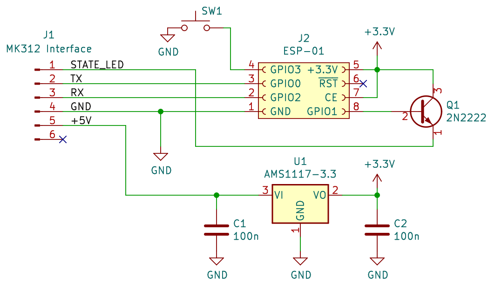
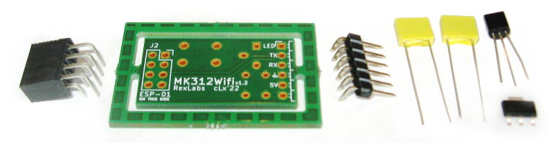
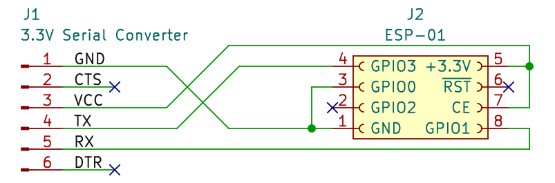
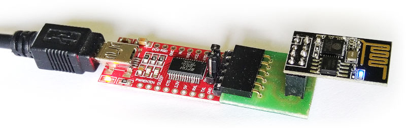
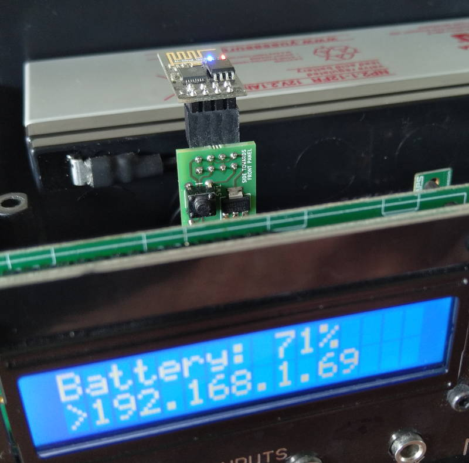
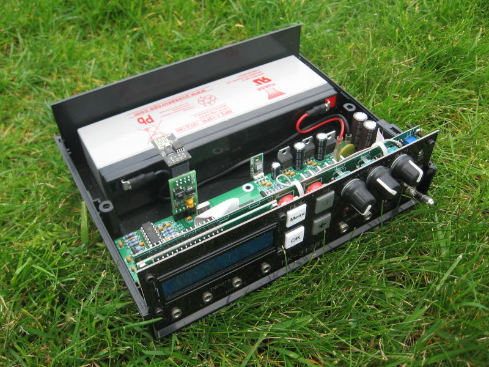

# MK312 WiFi adapter

A drop-in replacement for the HC-05 Bluetooth module on the MK-312BT, based on the **ESP8266-01S**. Pin-compatible with the same Radio Header socket — the box doesn't need any change.

This is a collaboration between **Rangarig** and **cLx**, with additional code imported from [timduru's branch](https://github.com/timduru/MK312WIFI/commits/timdev/). Upstream lives at [Rangarig/MK312WIFI](https://github.com/Rangarig/MK312WIFI) and is pulled into this repo as a `git subtree`.

> No guarantees are given. If you use this hardware to injure yourself, no responsibility is taken.

## Why use the WiFi adapter instead of the HC-05?

- Better range and reliability than Bluetooth Classic
- Works on **macOS Monterey+** and **iOS** (where HC-05 / Bluetooth Classic SPP is broken/unsupported)
- Easier integration with VR headsets, network apps, scripting from any language

The serial header on the MK-312BT is identical for both — swap modules without changing the box.

## What's in this directory

| Path | Contents |
|------|----------|
| [`firmware/`](firmware/) | Arduino `.ino` source plus pre-built `.bin` files for the ESP8266 |
| [`pcb/`](pcb/) | KiCad schematic + board source and fab gerbers for the adapter PCB |
| [`pcb/jlcpcb-package/`](pcb/jlcpcb-package/) | Ready-to-upload bundle for ordering 5 boards from JLCPCB with SMT assembly (~$20–25) — see its [README](pcb/jlcpcb-package/README.md) |
| [`media/`](media/) | Photos and schematics referenced by this README |

## Hardware

Use the provided PCB layout, or wire your own. **The MK-312BT supplies 5 V** on the Radio Header, so you need a 3.3 V regulator (the AMS1117-3.3 on the adapter PCB) — direct 5 V will kill the ESP. The signal-level resistor bridge is already on the box side, so no extra level-shifting is needed.



| ESP pin | In between | MK-312BT |
|---------|------------|----------|
| GND | — | GND |
| VCC | 3.3 V regulator (AMS1117-3.3) | VCC (5 V) |
| CHIP_EN | — | — |
| GPIO0 | — | TX |
| GPIO2 | — | RX |
| GPIO1 | NPN transistor | STATE |
| GPIO3 | AP-mode switch to GND | — |

The hardware UART outputs bootloader garbage that confuses the MK-312BT, so the firmware uses a software-serial implementation on the pins listed above.

## BOM (per adapter)

| Qty | Component |
|-----|-----------|
| 1 | ESP8266-01S module |
| 1 | AMS1117-3.3 regulator |
| 2 | 100 nF (104) ceramic disc capacitors |
| 1 | 2N2222 NPN transistor |
| 1 | Tactile switch 6×6 mm |
| 1 | 5-pin pin header, **right-angle** |
| 1 | 2×4 socket header, angled |

If you're ordering the PCB from JLCPCB, the [`pcb/jlcpcb-package/`](pcb/jlcpcb-package/) bundle has JLC pre-mount the AMS1117 for you — you hand-solder the six through-hole parts (~5–10 min per board).



## Flashing the ESP firmware

The ESP8266-01 runs on 3.3 V — **set your USB-serial adapter to 3.3 V mode** or the chip will die.

 

ESP-01 top view (row 1 = closer to the board edge):

| Row 1 | Pins | Row 2 |
|-------|------|-------|
| TX | o&nbsp;&nbsp;o | GND |
| EN | o&nbsp;&nbsp;o | — |
| RST | o&nbsp;&nbsp;o | PRG |
| 3.3V | o&nbsp;&nbsp;o | RX |

To enter programming mode, hold IO0/PRG at GND and briefly pulse RST to GND (or wire RTS from the USB-serial adapter to do it automatically — usually unnecessary).

### Option A — flash the provided `.bin` files

```sh
esptool --chip esp8266 --port /dev/ttyUSB0 --baud 115200 \
        write_flash 0x0 MK312Wifi.ino.bin

esptool --chip esp8266 --port /dev/ttyUSB0 --baud 115200 \
        write_flash 0xEB000 MK312Wifi.mklittlefs.bin
```

The second file holds the HTML/CSS/JS for the web UI on LittleFS at `0xEB000`.

If you have Arduino installed, `esptool` is also available at `~/.arduino15/packages/esp8266/hardware/esp8266/3.1.2/tools/esptool/esptool.py`.

### Option B — build from source with the Arduino IDE

Tested versions:

- Arduino IDE 1.8.19
- ESP8266 boards package 3.0.2 — add `http://arduino.esp8266.com/stable/package_esp8266com_index.json` under **File → Preferences → Additional Boards Manager URLs**, then install **Generic ESP8266 module** in Tools → Board Manager
- WifiManager library 2.0.5-beta — install from [tzapu/WifiManager](https://github.com/tzapu/WifiManager) via **Sketch → Include Library → Add .ZIP Library**
- LittleFS upload plugin — install [arduino-esp8266littlefs-plugin](https://github.com/earlephilhower/arduino-esp8266littlefs-plugin/releases) into the Arduino tools folder. The `data/` directory contents need to be uploaded to LittleFS for the web UI to work.

Open the `.ino`, compile, flash.

## First boot

Plug the adapter into the HC-05 socket facing the correct way and power on the MK-312BT.

The firmware negotiates a key with the box. If negotiation fails, the message LED blinks an error code:

| Blinks | Cause |
|--------|-------|
| 1 | Invalid checksum |
| 2 | Handshake failed at step 1 |
| 3 | Handshake failed at step 2 |
| 4 | Handshake failed at step 3 |
| 5 | Unexpected reply from device |
| 10 | Unexpected reply from poke operation |
| 11 | Unexpected reply from peek operation |

After successful handshake, the adapter enters AP mode. The MK-312BT LCD shows `WifiAP`.



1. Connect your phone to the WiFi network `MK312CONFIG-AP`
2. WifiManager's captive portal opens — pick your home WiFi and enter the password
3. The adapter connects to your network and shows its IP address on the MK-312BT LCD
4. The network settings are persisted — subsequent boots reconnect automatically

To change networks later: press the AP-mode button on the adapter, or boot with the configured network unavailable (it falls back to AP mode automatically).

## Network protocol

### Discovery

Send a UDP broadcast to port **8842** containing `MK312-ICQ`. The adapter replies with its IP address.

### Control

Open a TCP connection to the adapter on port **8843**. **One client at a time.**

From here it speaks the same protocol as the LINK serial port. Full reference: [docs.buttplug.io — Erostek ET-312B protocol](https://docs.buttplug.io/docs/stpihkal/protocols/erostek-et312b/).

- **Encrypted mode** (default): send `0x00`, receive `0x07`, then do the standard key negotiation.
- **Unencrypted mode** (optional): instead of normal key negotiation, send `0x2f4242`. This is an invalid checksum but the firmware recognizes it as a request for unencrypted mode. The reply is `0x69`. No encryption needed from there.

Existing serial-protocol clients should adapt with minimal changes; the encryption is the only difference.

## Web interface

Connect a browser to the adapter's IP on **port 80**. Simple HTML page using a **websocket server on port 81** for control. Message format: `<command>=<argument>`.

HTTP also exposes:

- `GET /EXEC?cmd=<command>&val=<argument>`
- `GET /RAW?cmd=<address>&val=<byte>`

Commands:

| Command | Argument |
|---------|----------|
| `Mode` | `0x76`–`0x8e` for the different modes |
| `DisableADC` | `1` to override pots, `0` to re-enable |
| `EnableADC` | `1` to restore pots, `0` to override |
| `LevelA` | `0`–`255` (requires `DisableADC=1`) |
| `LevelB` | `0`–`255` (same) |
| `startRamp` | (no argument) |
| `CutLevels` | `1` to set both channels to zero |
| `MultiAdjust` | `0`–`100` (scaled in the current mode range) |

## Using legacy serial clients

Software written for a real serial port (HC-05, RS-232 cable) can talk to the adapter through a virtual COM port:

- **Linux:** `socat -v pty,link=/home/$USER/tcptty0,raw tcp:<adapter-ip>:8843` — then connect your client to `/home/$USER/tcptty0`
- **Windows:** [VSPE](https://www.youtube.com/watch?v=7g6v_m208LQ) (Virtual Serial Port Emulator) is known to work

## Native clients

- See the example C# implementation that ships alongside this README upstream
- [clxjaguar/mk312-gui](https://github.com/clxjaguar/mk312-gui) — PyQt GUI with native support for cable, unencrypted, and legacy network links

## Bonus


